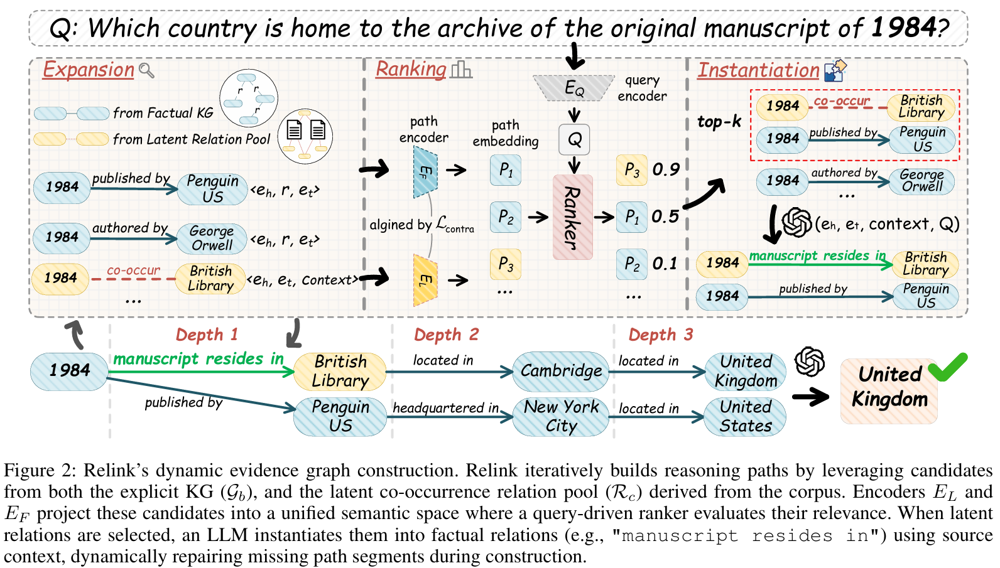

# Relink: Constructing Query-Driven Evidence Graph On-the-Fly for GraphRAG

Relink is a dynamic evidence-graph construction framework for GraphRAG. Instead of relying on a static knowledge graph, Relink builds a **query-specific and minimal evidence graph at runtime**, enabling more accurate and robust multi-hop reasoning.

---

## 📝 Abstract

Existing GraphRAG systems depend on pre-built static knowledge graphs, which are often incomplete and contain distractor facts that can mislead reasoning. Relink adopts a **reason-and-construct** paradigm: during query processing, the system dynamically selects relevant facts from both an explicit knowledge graph and a latent relation pool derived from text. This allows Relink to **repair missing reasoning chains** and **filter out irrelevant or misleading edges**, resulting in more precise and interpretable answers.

---

## 🔍 Method Overview



---

## 🚀 Quick Start (Python API)

### 0. Configure Redis and Neo4J databases
```bash
docker run -d --name relink-redis -p 6579:6379 redis
docker run -d --name relink-neo4j -p 9011:7474 -p 9012:7687 -e NEO4J_AUTH=neo4j/password 
```

### 1. Install dependencies and config
```bash
pip install -r requirements.txt
```

### Configure LLM and embedding models in config.py


### 2. Start path_scorer Server
```bash
cd app/path_scorer
python server.py
```

### 3. Start building index and reasoning
```bash
cd ./
python run.py
```


## 📄 License

MIT License
